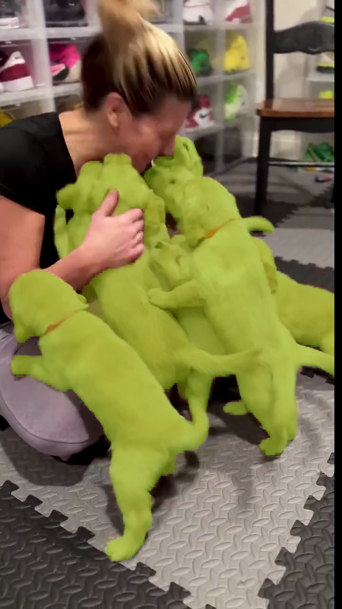
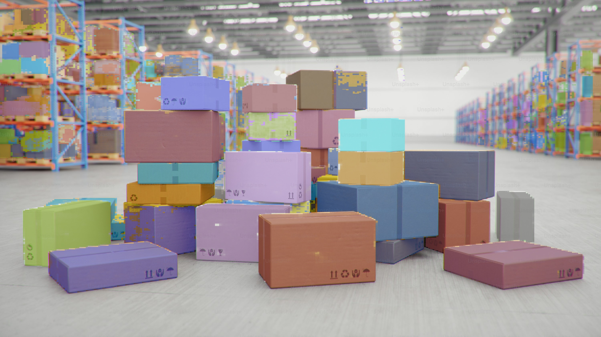

<div align="center">

# 🚀 SAM 3.0 to TensorRT Engine
**Export Meta AI's Segment Anything 3 (SAM 3) model to an ONNX graph and build a high-performance TensorRT engine for real-time Promptable Concept Segmentation (PCS).**

[](https://opensource.org/licenses/MIT)
[](https://isocpp.org/)
[](https://developer.nvidia.com/cuda-zone)
[](https://developer.nvidia.com/tensorrt)

</div>

## ✨ Key Features & Architecture
- **Incredible Efficiency**: Up to **9x speedup** on B200 compared to running the exact same model in native PyTorch. 
- **Dynamic Bounding Box Tracking**: Outputs inference bounding box (`pred_boxes`) and logits out of the box. Computes probabilities and visually renders custom bounding boxes straight from engine inference.
- **Dynamic Multi-Prompting via C++/Python Interop**: A fast C++ TensorRT pipeline that invokes a seamless Python sub-process to accurately tokenize multiple user text prompts at runtime without any hardcoded vocabularies.
- **Zero-copy Unified Memory Inferencing**: Deep CUDA architectural optimization (`cudaHostAllocMapped`) that detects if you are running on unified memory architectures (NVIDIA Jetson, DGX Spark). Eliminates PCIe copies entirely for maximum throughput in robotics!
- **Pure ONNX Export**: Wraps `Sam3Model` elegantly and securely exports via Opset 17 mapping directly to `pred_roles`.

---

## 🏎️ Hardware Benchmarks
*The numbers show end-to-end image processing latency per image (4K resolution) in ms excluding image load/save time.*

| Hardware | HF+PyTorch | TensorRT+CUDA | Speedup | Notes |
| :--- | :--- | :--- | :--- | :--- |
| **B200** (SXM6) | 160.0 ms | **17.7 ms** | `9.03x` | 🚀 |
| **H100** (SXM5) | 213.2 ms | **24.9 ms** | `8.56x` | |
| **A100** (SXM4) | 314.1 ms | **48.8 ms** | `6.43x` | 40GB variant |
| **RTX 3090** | 438.0 ms | **75.0 ms** | `5.82x` | |
| **Jetson Orin NX** | 6600.0 ms| **950.0 ms**| `6.95x` | **Zero-copy enabled** ⚡ |

*(Note: the PyTorch path is GPU-backed too—this directly compares engine efficiency, not CPU vs GPU).*

---

## 🎨 Visual Demostrations

### Target Anything Dynamically
Because of custom tokenization logic, simply input target texts into the C++ binary!

[](https://youtube.com/shorts/hHvhQ514Evs?feature=share)

| Semantic Segmentation (`prompt="dog"`) | Instance Segmentation (`prompt="box"`) |
| :---: | :---: |
|  |  |

---

## 📂 Internal Repository Blueprint
- `python/` - Contains Opset 17 `onnxexport.py`, the CLI tokenizer mapper `tokenize_prompt.py`, and pure Python visualization handlers (`visualize.py`).
- `cpp/` - Core C++ and CUDA pipelines. Implements `SAM3_PCS` parsing bounding boxes into OpenCV layers, and supports direct zero-copy GPU mapping (`sam3.cu`).
- `docker/` - Clean `nvcr.io/nvidia/pytorch` based containers handling apt-dependencies natively for both `x86_64` and `aarch64`.
- `onnx_weights/` - Central runtime location for external weights and exported config trees.

---

## 🚀 Quickstart Guide

### 1. Model Preparation
1. Accept the agreement at [facebook/sam3](https://huggingface.co/facebook/sam3).
2. Grab/set your `HF_TOKEN`.

### 2. Sandbox Setup (Docker)
We utilize a single environment to do the parsing, exporting, and execution perfectly.
```bash
# Architecture x86_64 (Standard PC/Server)
docker build -t sam3-trt -f docker/Dockerfile.x86 .

# Architecture aarch64 (NVIDIA Jetson / Tegra / Spark)
docker build -t sam3-trt-aarch64 -f docker/Dockerfile.aarch64 .
```

Instantiate container with necessary IPC buffers mounted:
```bash
export HF_TOKEN=<YOUR_TOKEN>
docker run -it --rm --network=host --gpus all \
  --ipc=host --ulimit memlock=-1 --ulimit stack=67108864 \
  --runtime=nvidia --env HF_TOKEN \
  -v "$PWD":/workspace -w /workspace \
  sam3-trt bash
```

### 3. Generate the ONNX Base Components
From inside the container:
```bash
# Export the HuggingFace Processor configuration schema (required for later)
python3 python/export_tokenizer.py

# Convert SAM 3 PyTorch pipeline (will run natively on CPU during export for highest numeric stability)
python3 python/onnxexport.py
```
*(Produces `onnx_weights/sam3_dynamic.onnx`).*

### 4. Build Optimized TensorRT Graph
This consumes the `.onnx` and optimizes specific GPU Kernels for your exact card!
```bash
trtexec --onnx=onnx_weights/sam3_dynamic.onnx --saveEngine=sam3_fp16.plan --fp16 --verbose
```

### 5. Compile the C++/CUDA Native Engine
```bash
mkdir -p cpp/build && cd cpp/build
cmake ..
make -j$(nproc)
```

### 6. Test Inference: Custom Prompt + Bounding Boxes 🎯
Provide your custom targets completely dynamically (e.g. `helmet`, `car, wheel`). 
`sam3_pcs_app` directly interfaces with the Python tokenizer out-of-band and executes raw hardware-accelerated bounding box mappings seamlessly. 
```bash
# Basic run saving visualized Bounding Box outputs to `results/`
./sam3_pcs_app /workspace/test_images /workspace/sam3_fp16.plan "helmet"
```

> **Raw Performance Benchmarking Mode**: Append `1` to run blind CUDA loops without OpenCV image saves to benchmark raw inference speed.
> `./sam3_pcs_app /workspace/test_images /workspace/sam3_fp16.plan "helmet" 1`

---

## 🔧 Extensions & Future Support
Because this architecture natively leverages CUDA unified topologies out-of-the-box it opens many pipelines:
- **ROS 2 Zero-Copy Support**: Pass Image/Lidar buffers directly into `sam3.cu` memory layers without CPU bottlenecking.
- **TTS Driven Active Segmenting**: Add transcription loops routing directly to the custom prompter.

---
## 🤝 Open Source License
This project is officially released under the **MIT License**.
*Building performant pipelines takes dedication. If this accelerated your research, consider dropping a ⭐!*
